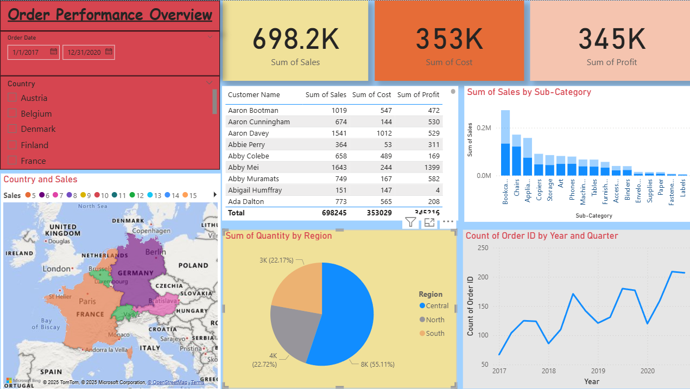

# 📊 Order Performance Overview Dashboard (Power BI)

This Power BI project provides an interactive and comprehensive dashboard to analyze **order performance metrics** for a business. It helps stakeholders track key performance indicators (KPIs) such as total sales, order volumes, shipping performance, and customer segmentation.

---

## 🧩 Features

- **Sales & Order Trends**: Visualize order volume and revenue over time.
- **Category & Segment Breakdown**: Drill into order performance by category, region, and customer segment.
- **Shipping Analysis**: Track delivery statuses, shipment delays, and performance.
- **Interactive Filters**: Apply slicers by category, date range, region, and customer segment.
- **KPIs Display**: Highlight total sales, number of orders, average shipping delay, and more.

---

## 📁 File Structure

- `Order performance overview.pbix` - The main Power BI file containing all datasets, visualizations, and DAX logic.

---

## 🛠️ Tools & Technologies

- **Microsoft Power BI Desktop**
- **DAX (Data Analysis Expressions)**
- **Power Query (ETL)**
- **Custom visuals & slicers**

---

## 🚀 Getting Started

1. Download and open `Order performance overview.pbix` in Power BI Desktop.
2. Explore dashboards and interact with filters to gain insights.
3. (Optional) Connect to your own dataset by updating data source paths in Power Query Editor.

---

## 📌 Use Cases

- For managers to evaluate supply chain performance.
- For sales teams to identify best-selling regions and product segments.
- For business analysts to detect delivery delays and performance gaps.

---

## 💡 Insights & Learnings

This dashboard showcases the power of visual analytics in making data-driven decisions. The blend of KPIs, trend analysis, and category breakdown enables better business oversight and strategic planning.

---

## 📷 Preview

---

## 📝 Author

**Sren Sreynich**  
📍 MCA Student | Data Enthusiast  
🔗 [LinkedIn](https://www.linkedin.com/in/sren-sreynich-0a067a323/) 

---

## ⭐️ Contributions

Suggestions or improvements are welcome! Feel free to fork, raise issues, or submit a pull request.

---

## 📄 License

This project is open-source and free to use under the [MIT License](LICENSE).

